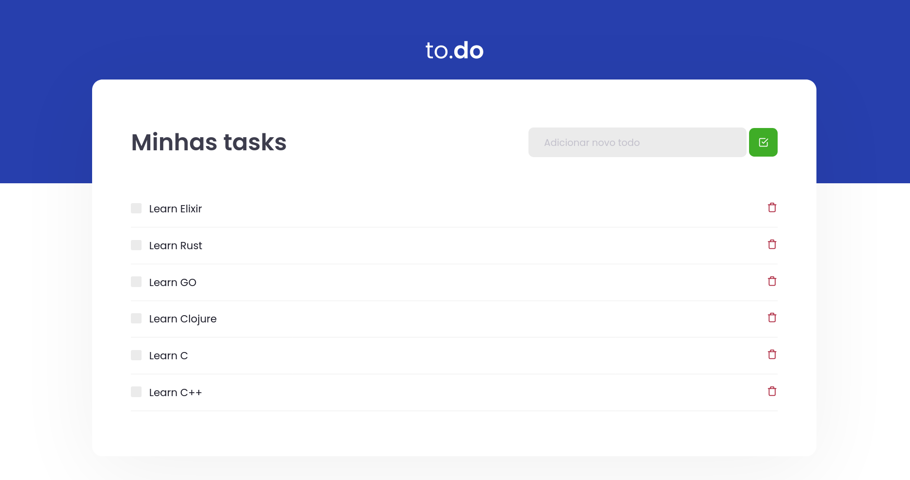

# Rocket Seat Ignite - To do list

<p align="center">
  
</p>

[](https://app.netlify.com/sites/romantic-goodall-172e75/deploys)

- Production: https://todo1776.netlify.app/

## Table of Contents

- [About](#about)
- [Getting Started](#getting_started)
- [Usage](#usage)
- [Resources](#resources)

## About <a name = "about"></a>

A simple to-do list made with ReactJS, Typescript and Jest.

## Getting Started <a name = "getting_started"></a>

### Prerequisites

- node > 12.0.0
- yarn > 1.22.0

### Installing

1. Clone this repo locally and install node packages:

```bash
$ git clone https://github.com/librity/ignite_todo_list.git
$ cd ignite_todo_list
$ yarn install
```

2. Start a dev server:

```bash
$ yarn dev
```

3. Open http://localhost:8080/ on your web browser.

### Testing

Run tests with jest:

```bash
$ yarn test
```

## Usage <a name = "usage"></a>

You can add and remove tasks from the interface.
You can also mark tem as done.

## Resources <a name = "resources"></a>

- https://reactjs.org/docs/react-component.html
- https://prettier.io/docs/en/configuration.html

- https://www.w3schools.com/jsref/jsref_random.asp
- https://www.dyn-web.com/javascript/arrays/add.php
- https://inspiredwebdev.com/find-replace-in-array/

- https://stackoverflow.com/questions/154059/how-can-i-check-for-an-empty-undefined-null-string-in-javascript
- https://stackoverflow.com/questions/54876239/find-and-replace-object-in-array-based-on-id
